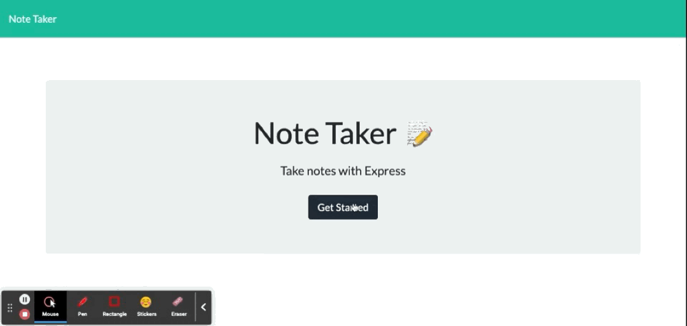

# Note-Taker2

## User Story
  
```
AS A small business owner
I WANT to be able to write and save notes
SO THAT I can organize my thoughts and keep track of tasks I need to complete

```

## Description
  This application allows you to save notes with a title and plain text. The Note Taker app makes creating, viewing, and deleting notes.
## Heroku 
[Note Taker App](https://secure-temple-27140.herokuapp.com/)
## Screenshot

## Table of Contents
- [Description](#description)
- [Heroku Link](#Heroku)
- [Installation](#installation)
- [Usage](#usage)
- [Languages](#languages)
- [Contributing](#contributing)
- [Reference](#reference)
- [Questions](#questions)
## Installation
  `npm init -y`
  
  `npm install express`
## Usage
  Run the following command at th root of your project and answer the prompted questions:<br />

  `npm start`

  
## Languages
  JavaScript,Node,HTML,CSS,Express
## Contributing
  ChunYu Chang
## Reference
  https://github.com/kara-krzystan/note-taker <br />
  Class Moudles <br />
  https://github.com/mr91217/zookeepr<br />
## Questions
 Contact me<br />

## Contact
GitHub: [mr91217](https://github.com/mr91217)<br />
<br />
Email: mr91217@gmail.com<br />
<br />